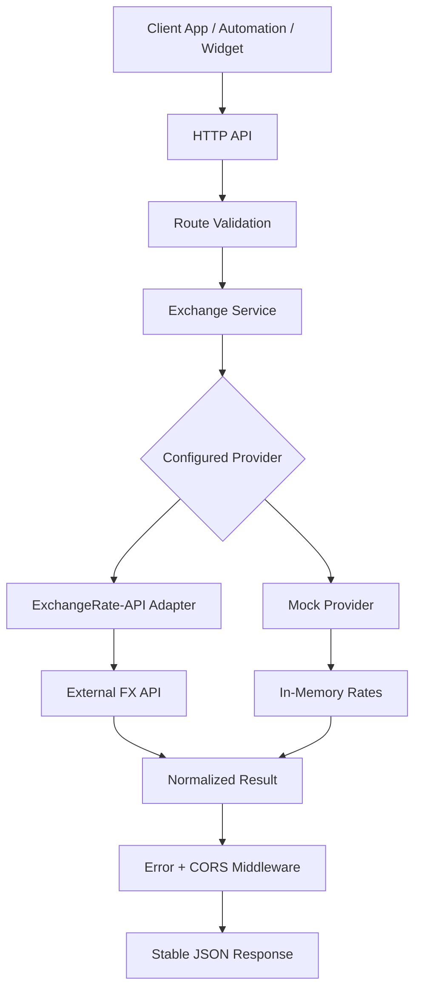

# Currency Exchange Integration Service

## 🚀 Overview
Currency Exchange Integration Service is an asynchronous REST API that gives product teams a stable, internal-facing contract for foreign exchange data. Instead of pushing provider-specific logic into every frontend, widget, checkout flow, or automation job, it centralizes validation, provider access, error handling, and environment-based configuration behind one lightweight service.

## 🎯 Problem
Teams that need currency conversion usually end up coupling directly to third-party FX APIs. That creates repeated work across products:

- every client has to manage provider keys, payload formats, and failure modes
- validation logic gets duplicated across UIs, backend jobs, and partner integrations
- browser-based use cases need safe cross-origin access without exposing provider complexity
- swapping providers or adding a mock environment becomes operationally expensive

For startups and platform teams, this turns a simple business requirement into recurring integration overhead.

## 💡 Solution
This system exposes a clean HTTP layer for currency conversion and latest-rate lookups while isolating upstream provider logic behind a pluggable interface. It validates inputs at the API boundary, normalizes success and error responses into a predictable JSON contract, and supports both a live external provider and a deterministic mock mode for local development, testing, and demos.

## ⚙️ Features
- Stateless FX API designed for use by frontend apps, internal services, and partner-facing widgets
- Asynchronous request handling with shared outbound HTTP session management
- Pluggable provider architecture with runtime provider selection via environment settings
- Deterministic mock provider for offline development and repeatable automated tests
- Centralized validation for ISO-style currency codes and numeric amount parsing
- Consistent JSON response envelopes for both successful requests and upstream failures
- CORS middleware for browser-based integrations and embeddable widgets
- Service-layer filtering of requested symbols to reduce client-side post-processing
- Clean separation of routing, business logic, provider adapters, and configuration
- Horizontal-scale-friendly design with no local persistence or instance affinity

## 🧠 Architecture
The service is organized as a small but production-minded integration boundary:

- `main.py` starts the API and delegates application assembly to the app factory.
- `app/app_factory.py` loads environment settings, registers middleware, creates a shared `aiohttp.ClientSession`, and injects the selected provider into the service layer.
- `app/api/routes.py` handles HTTP routing, validates request parameters, and keeps malformed traffic from leaking into core logic.
- `app/services/exchange_service.py` owns the business contract: conversion output, rate lookup, and symbol filtering.
- `app/providers/` contains the provider interface and adapters, allowing the live data source to be replaced without changing the API contract.
- `app/api/middlewares.py` standardizes cross-cutting behavior such as JSON error responses and CORS headers.

Key technical decisions:

- A provider protocol decouples the system from any single exchange-rate vendor.
- The API is intentionally stateless, which simplifies deployment behind a load balancer and avoids stale-data persistence concerns.
- A shared async HTTP client is created on startup and cleaned up on shutdown to avoid per-request connection overhead.
- Mock mode is treated as a first-class runtime path, improving delivery speed for tests, demos, and local work.



## 🔧 Tech Stack
- Python 3.11/3.12
- `aiohttp`
- `python-dotenv`
- `pytest`
- `pytest-asyncio`
- `pytest-aiohttp`
- ExchangeRate-API

## 🧪 Example Usage
Run the service locally:

```bash
python3 main.py
```

Convert an amount:

```bash
curl "http://localhost:8080/v1/convert?base=USD&quote=EUR&amount=100"
```

Fetch filtered rates:

```bash
curl "http://localhost:8080/v1/rates/USD?symbols=EUR,GBP"
```

Example response:

```json
{
  "data": {
    "base": "USD",
    "quote": "EUR",
    "amount": 100.0,
    "rate": 0.92,
    "result": 92.0,
    "provider": "exchangerate_api"
  }
}
```

## 🎯 Why This Matters
For startups:
This service removes duplicated integration work across pricing, checkout, reporting, and partner-facing products. It gives small teams a reusable FX layer without forcing each product squad to become experts in provider behavior and operational edge cases.

For AI systems:
AI agents and workflow-driven systems perform better when external dependencies are wrapped in predictable, machine-consumable contracts. This API gives them normalized inputs, validated parameters, and deterministic failure modes that are far easier to orchestrate safely than raw third-party APIs.

For automation:
Currency conversion often sits inside invoicing flows, quote generation, analytics pipelines, and cross-border operations. A stateless HTTP service with a clean contract is easier to compose into automations, easier to test, and easier to evolve than vendor logic embedded across multiple jobs and apps.

## 📈 Possible Extensions
- Add caching and TTL-based refresh policies to reduce latency and provider cost
- Support provider failover or multi-provider aggregation for higher availability
- Introduce authentication, quotas, and audit logging for multi-tenant usage
- Add batch conversion and historical-rate endpoints for reporting workloads
- Ship container-first deployment assets and observability hooks for production operations
- Add structured metrics and tracing for upstream latency, error rates, and usage patterns

## API Surface
- `GET /healthz` returns a simple health signal for service monitoring
- `GET /v1/convert?base=USD&quote=EUR&amount=10` converts one currency into another
- `GET /v1/rates/{base}?symbols=EUR,GBP` returns the latest rates for a base currency, optionally filtered to selected symbols

## Configuration
- `API_PROVIDER`: `exchangerate_api` or `mock`
- `EXCHANGERATE_API_KEY`: required for the live provider
- `EXCHANGERATE_BASE_URL`: upstream provider base URL
- `HTTP_TIMEOUT_SECONDS`: outbound provider timeout
- `CORS_ENABLED`: enables or disables CORS middleware
- `CORS_ALLOWED_ORIGINS`: `*` or a comma-separated allowlist of trusted origins

## Quality Signals
- Route validation, service behavior, provider parsing, and API integration paths are covered by tests
- Errors are normalized into explicit JSON payloads instead of leaking raw exceptions
- The codebase has clear boundaries between API, services, providers, and configuration
- The system can run against a mock provider without external dependencies, which improves reliability in CI and local development
